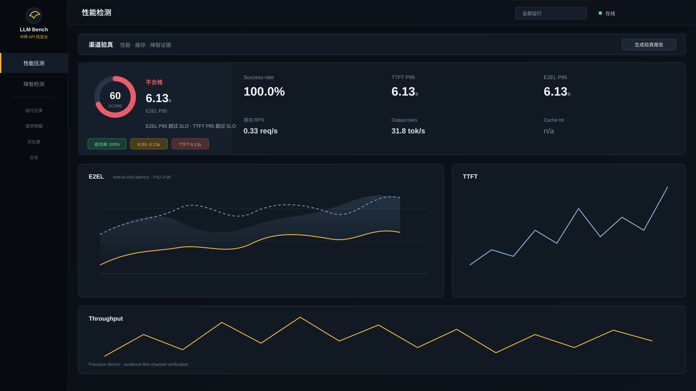

<p align="center"></p>

<h1 align="center">Precision Bench</h1>

<p align="center"><b>Load testing, but for LLM relay APIs.</b><br>Stress test the channel, verify prompt caching, and detect silent model degradation — from one local dashboard.</p>

<p align="center">
  
  
  
  
  
</p>

<p align="center">
  <b><a href="#quick-start">Quick start</a></b> ·
  <a href="#capabilities">Capabilities</a> ·
  <a href="docs/demo.md">Demo</a> ·
  <a href="README.zh-CN.md">简体中文</a> ·
  <a href="CHANGELOG.md">Changelog</a> ·
  <a href="CONTRIBUTING.md">Contributing</a> ·
  <a href="SECURITY.md">Security</a>
</p>

<p align="center"></p>
<p align="center"><i>Paste <code>base_url + api_key + model</code>, run a load test, and get reproducible evidence: waveforms, percentiles, cache verdicts, and a degradation baseline.</i></p>

---

## Why another load tester?

Generic tools (k6, Locust, vegeta) know HTTP but not LLMs; LLM observability platforms (Langfuse, Helicone) know traces but do not generate real concurrency. **Precision Bench** sits in between: it actively drives an LLM channel the way production traffic does, then audits the answers a relay gives you.

- **Paste-to-test** — three-piece / JSON / curl / Chinese-labeled paste; protocol auto-detected (OpenAI-compatible, Anthropic Messages, OpenRouter).
- **Honest latency** — TTFT / TPOT / ITL / E2E from a monotonic clock, P50–P99.9 with linear interpolation, plus **coordinated-omission correction** for open-loop runs (the wrk2/`k6` methodology).
- **Prompt-cache truth** — normalizes usage fields from OpenAI / Anthropic / DeepSeek / Kimi / Qwen / GLM / Gemini, then runs an active fixed-prefix probe to catch **relays that report cache hits but never actually serve them faster**.
- **Degradation detection** — eight scored dimensions (math, knowledge, Chinese, instruction following, JSON, code, long-context needle, self-consistency) with output fingerprints and baseline comparison, so a silent model swap shows up as a verdict, not a vibe.
- **Relay-aware** — per-task proxy (direct for mainland endpoints, `127.0.0.1:7890` for cross-border), TLS verification switch, anti-identification prompt jitter, scheduled checks with Feishu/webhook alerts.
- **Auditable by design** — SQLite (WAL) storage, CSV/JSON/Markdown exports, a one-click channel verification report, and metrics you can re-derive from the raw samples.

## Quick start

Requirements: Python 3.11+ and [uv](https://docs.astral.sh/uv/).

```bash
# 1. start the dashboard  ->  http://127.0.0.1:8787
./run.sh

# 2. (optional) local mock upstream to try the tool without spending tokens
./run_mock.sh
```

Or run it in Docker (multi-stage build, non-root user, history persisted in a named volume):

```bash
docker compose up -d --build   # -> http://127.0.0.1:8787
```

Then paste this into the left panel:

```text
base_url: http://127.0.0.1:8899
api_key: demo
model: gpt-4o
```

Keep the default closed-loop profile, set **Total requests** to `20`, hit start. Full walkthrough: [docs/demo.md](docs/demo.md).

Run it as a launchd service:

```bash
./service.sh install    # auto-start on boot + restart on crash
./service.sh status
./service.sh logs
```

> ⚠️ Run **one process only** — live run state lives in memory. Do not bind `HOST=0.0.0.0` to the public internet; put it behind an authenticated reverse proxy.

## Capabilities

### 1. Load testing

| Mode | Mechanism | Use it for |
|---|---|---|
| Closed-loop | *k* workers loop until total requests finish | quality runs, realistic user behaviour |
| Open-loop | send at `start + i/rate`, optional jitter; report **observed** and **corrected** latency | capacity, rate-limit discovery |
| Duration | ramp → steady → cooldown | minute-to-hour stability |

Load profiles cover input length distribution (fixed / uniform / normal), `max_tokens`, `temperature`, `top_p`, system prompts, warmup, retries, and ramp/cooldown. Eight charts: E2E percentile envelope, TTFT, TPOT, throughput, latency heatmap, error timeline, distribution + CDF, and multi-channel comparison.

```bash
# three metrics that must never be conflated
RPS  = successful requests / wall clock     # completed RPS
      (attempted RPS is reported separately)
Goodput = requests meeting TTFT & TPOT SLO targets / total
corrected = arrival time - planned send time   # CO correction
```

### 2. Prompt-cache verification

Two independent checks:

1. **Passive** — every run normalizes the provider's usage fields (including `cache_read` / `cache_creation` for Anthropic-style APIs) and reports token hit rate, hit vs miss request counts, **hit vs miss TTFT**, and cache-read/write pricing.
2. **Active probe** — replay the same long prefix N times (write round → hit rounds) in the background, cancelable and paginated. Verdicts: **effective / suspected fake / not reported** — a relay that counts tokens as cached but does not speed up is exposed here.

Cache-friendly mode disables request randomization and warms up at least once before sampling, so your first measured request is not a provider-side cache write.

### 3. Degradation detection

| Dimension | Modeled after | Scoring |
|---|---|---|
| Math reasoning | GSM8K / MATH | exact numeric match (last number) |
| Knowledge | MMLU | multiple-choice letter extraction |
| Chinese | C-Eval / CMMLU | multiple-choice letter extraction |
| Instruction following | IFEval | word/char counts, first/last words, banned words |
| Structured output | JSON | parse + type/length validation |
| Code reasoning | HumanEval | exact prediction match |
| Long context | Needle-in-Haystack | constructed at runtime, retrieval hit |
| Self-consistency | — | same question twice, answers must agree |

The first run for a `base_url + model` pair becomes the **baseline**; later runs compare total score (default threshold 10pp), per-dimension score, and an output **fingerprint** (normalized answer hash). Verdict: **normal / suspected degradation**. All scoring is deterministic code — recomputable, no judge model.

## Supported providers

| Protocol | Examples | Notes |
|---|---|---|
| OpenAI-compatible | OpenAI, DeepSeek, Qwen, GLM, Moonshot, vLLM, Ollama, most relays | usage normalization for cache fields |
| Anthropic Messages | Claude, Bedrock-style relays | `cache_read_input_tokens` / `cache_creation_input_tokens` |
| OpenRouter | any model behind `sk-or-…` | auto-detected, default base URL filled in |

Provider-specific cache presets (prompt-prefix length) ship for OpenAI, Qwen, DeepSeek, Kimi, GLM, and Anthropic. Per-model pricing (input / output / cache read / cache write) feeds the cost cards.

## Metric definitions

`t0` request sent · `tf` first content token · `tl` last token · `N` output tokens.

| Metric | Formula | Notes |
|---|---|---|
| TTFT | `tf − t0` | skips role / ping / comment frames |
| E2E | `tl − t0` | end-to-end latency |
| TPOT | `(tl − tf)/(N−1)` | aligns with vLLM/MLPerf |
| ITL | mean / P99 of adjacent chunk gaps | decode jitter |
| Throughput | `N/(tl−tf)` | decode rate only |
| Percentiles | P50/90/95/99/99.9 | linear interpolation (not HDR) |

Token counts come from the API `usage` object when present; otherwise tiktoken is used and the UI labels the value as an estimate. Warmup requests (default 3) are excluded from statistics. Full reference — including the error taxonomy and API table — is in the [Chinese README](README.zh-CN.md#指标口径ui-内亦可复算).

## Documentation

| Guide | When you need it |
|---|---|
| [docs/demo.md](docs/demo.md) | first five minutes with the local mock upstream |
| [README.zh-CN.md](README.zh-CN.md) | full reference: feature list, metric formulas, complete API table (Chinese) |
| [DESIGN.md](DESIGN.md) | UI tokens, component states, chart rules, accessibility checklist |
| [CONTRIBUTING.md](CONTRIBUTING.md) | dev setup, test commands, PR expectations |
| [SECURITY.md](SECURITY.md) | threat model, key handling, reporting a vulnerability |
| [CHANGELOG.md](CHANGELOG.md) | what changed between versions |
| [docs/releasing.md](docs/releasing.md) | release checklist for maintainers |

## Project layout

```
server/   main.py (FastAPI + SSE) · engine.py (scheduling / CO correction)
          providers.py (3 protocols) · parse.py · metrics.py · stats.py
          store.py (SQLite) · cachecheck.py · scheduler.py · notifier.py
web/      index.html · app.js · bench.js · ui.js · style.css (zero build step,
          ECharts bundled locally — no external CDN)
tests/    mock upstream + unit / end-to-end suite
docs/     demo, release checklist, preview assets
```

## Contributing

Issues and pull requests are welcome. See [CONTRIBUTING.md](CONTRIBUTING.md) for setup and the test gates:

```bash
uv sync --frozen --group dev
uv run --frozen pytest          # 88 tests, coverage gate 55%
```

## Security

- API keys are never written to the database and are stripped from every API response/export.
- Model-list requests send the key in the body, never in a URL or query string.
- Report vulnerabilities privately via [SECURITY.md](SECURITY.md).

## License

[MIT](LICENSE)
