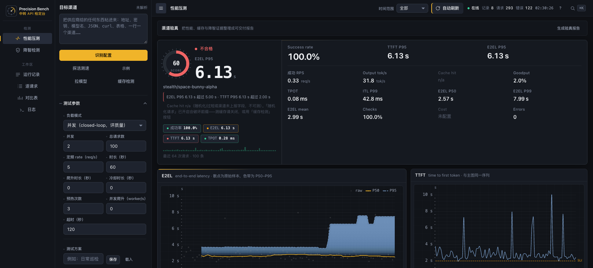
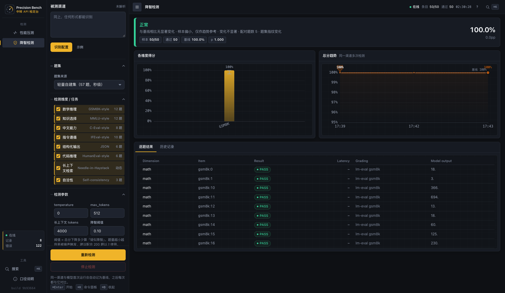
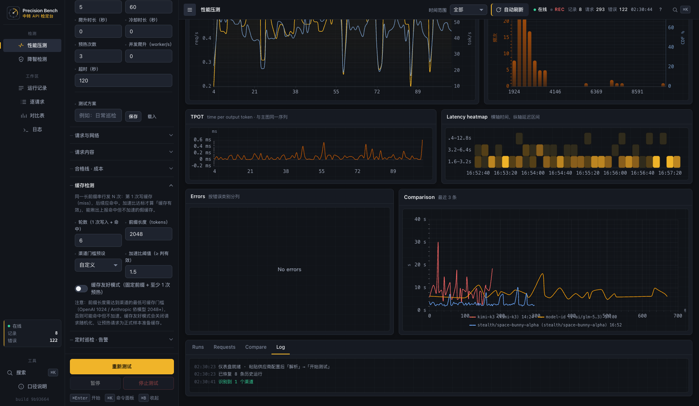
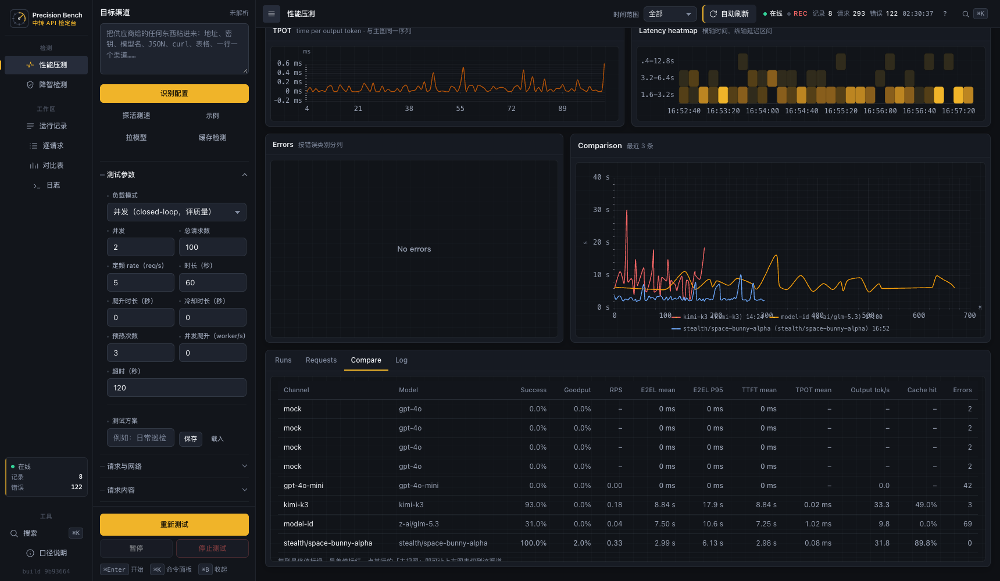
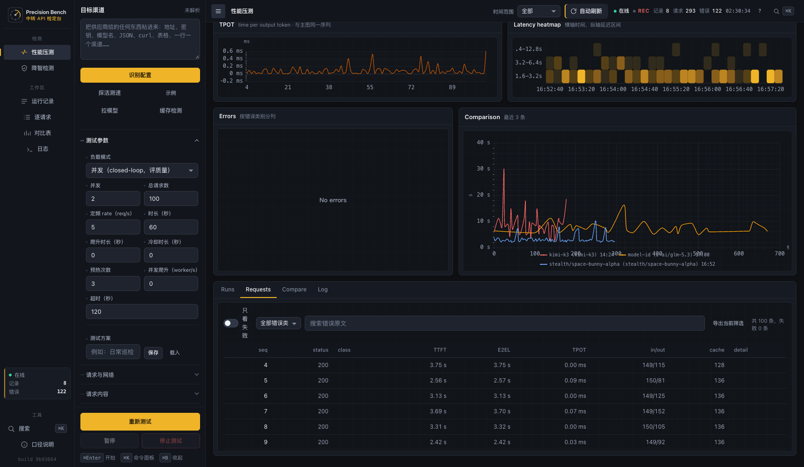

<p align="center"></p>

<h1 align="center">Precision Bench</h1>

<p align="center"><b>中转 API 检定台 · LLM 压测 / Prompt 缓存验真 / 降智检测</b></p>

<p align="center">
  
  
  
  
  
  
  
</p>

<p align="center">
  <a href="README.md">English</a> · <b>简体中文</b> · <a href="docs/demo.md">Demo</a> · <a href="CONTRIBUTING.md">Contributing</a> · <a href="CHANGELOG.md">Changelog</a> · <a href="SECURITY.md">Security</a>
</p>



第三方 **LLM 中转 API** 性能、稳定性与质量检定平台。粘贴供应商给的 `base_url + api_key + model` 即可测，输出可复算的原始指标、波形、性能判定、缓存验证与降智检测结果。

- 协议：**OpenAI 兼容** + **Anthropic Messages** + **OpenRouter**（聚合网关，OpenAI 兼容；粘贴 `sk-or-…` 或正文含 openrouter 自动识别并补 `https://openrouter.ai/api/v1`）
- 形态：本地服务 + **Precision Bench 中转 API 检定台**（蓝黑画布 + 琥珀校准针 + 健康分环；ECharts 本地化，零外网依赖）
- 模式：并发（closed-loop）/ 定频（open-loop，**含 coordinated omission 修正**）/ 时长（长时稳定性）
- 批量：多个供应商一键横评叠加；定时巡检 + Webhook/飞书告警
- 存储：SQLite（WAL），长跑持久化、断线可恢复

[快速开始](#快速开始) · [功能一览](#功能一览) · [指标口径](#指标口径ui-内亦可复算) · [API](#api) · [测试](#测试) · [发布清单](docs/releasing.md)

## 品牌定位

- **产品名**：LLM Bench
- **产品副名**：Precision Bench · 中转 API 检定台
- **一句话定位**：验证中转渠道的真实速度、真实成本与真实智力，而不是只展示一条漂亮的延迟曲线。

`LLM Bench` 保留作为短名和兼容名称；`Precision Bench / 中转 API 检定台` 负责传达产品差异，避免与通用模型评测框架混淆。

## 功能一览

| 功能 | 说明 |
|---|---|
| 粘贴即测 | 三件套 / JSON / curl / 中文标签 / 多供应商分隔，自动识别协议（含 OpenRouter：`sk-or-` 或正文提及即归类并补默认 base_url） |
| 探活测速 | 单次请求，返回 TTFT / E2E / TPOT / **DNS·TCP·TLS 分段耗时** / in·out token |
| 拉取模型 | 查询上游 `/v1/models`，确认可用模型与渠道真伪 |
| 三种负载 | 并发 / 定频（CO 修正）/ 时长；可配预热、重试、抖动、代理、TLS |
| 场景化流量 | 输入长度分布（固定/均匀/正态）、max_tokens、temperature |
| 反识别 | prompt 随机化 + 长度可变 + 定时抖动，降低被供应商识别优待 |
| 8 张波形图 | E2E 分位包络、TTFT、TPOT、吞吐、延迟热力图、错误时间轴、分布+CDF、多供应商横评 |
| 指标卡 | 请求/成功率/Goodput/成功 RPS/尝试 RPS/延迟分位/吞吐/**成本**（阈值着色对齐侧栏合格线） |
| SLO 徽章 | 判定块下四枚徽章（成功率/TTFT/TPOT/E2EL）逐项对着合格线着色：达标绿、偏慢黄、超线红、不可测灰（语义状态色） |
| 对比表 | 多供应商横向对比，最优绿高亮/最差红，一眼看出差距 |
| 实时日志 | 失败样本、运行事件、探活结果滚动输出 |
| 历史恢复 | 刷新/重启后自动载入最近 8 条运行，图表续看 |
| 导出 | CSV 原始样本 / JSON 汇总 / **Markdown 报告** |
| 定时巡检 | cron 周期任务；告警规则（成功率、延迟、连续失败）+ 飞书/Webhook |
| 成本估算 | 填输入/输出/缓存读/缓存写 ¥每百万 token，自动算每请求与总额 |
| 桌面通知 | 运行结束浏览器通知 |
| 快捷键 | `⌘/Ctrl+Enter` 开始（跟当前视图：压测/降智） · `⌘/Ctrl+K` 命令面板 · `⌘/Ctrl+B` 收起侧栏 |
| 缓存指标 | 兼容 OpenAI / Anthropic / DeepSeek / Kimi / Gemini 结构；报命中率与**命中 vs 未命中的 TTFT 对比**；缓存友好模式可先预热再进入正式采样 |
| 缓存检测 | 同一长前缀串行 N 次主动验证：揪出「上报命中但不加速」的假缓存；判定 有效/疑似假缓存/未上报；支持取消、分页历史与基线对比 |
| 验真报告 | 一键汇总性能、缓存、降智、SLO 与成本证据，可复制/下载 Markdown |
| 测试方案 | 保存本地参数方案，一键复现常用压测配置，不保存 API key |
| 指标口径 | 顶栏 `?` 一键查看全部指标定义 |

---

> 前端设计与实现约定见 **[docs/DESIGN.md](./docs/DESIGN.md)**（令牌、组件六态、图表规范、无障碍硬性要求、验收清单）。

## 界面

单页仪表盘，左侧展开式导航（160px Precision Bench 徽标，`≤1180px` 收窄 / `≤1100px` 配置栏改为浮层）切换两个视图（`/` 处；`/#bench` 进入降智检测）：

| 视图 | 用途 |
|---|---|
| **性能压测** | 延迟 / 吞吐 / 稳定性 波形图、探活测速、拉模型、成本、定时巡检 |
| **降智检测** | 能力探测、自动判分、基线对比、降智判定 |

工作区四个页签：**运行记录 / 逐请求 / 对比表 / 日志**。

### 截图

降智检测（八维度判分 + 基线对比）：



缓存检测面板（轮数 / 前缀长度 / 渠道门槛 / 加速比阈值 / 缓存友好模式）：



多渠道横评：



逐请求样本明细：



全部视图截图见 [docs/screenshots.md](docs/screenshots.md)。

- **可折叠配置栏**：`⌘/Ctrl+B` 或顶栏按钮收起；点「开始测试」后自动收起，图表占满全宽（状态记忆）
- **仪表盘栅格**：主次分明——E2E 主图占 8×2 大位，TTFT/TPOT 右侧堆叠，吞吐/分布、热力/错误按 8+4 配对，横评通栏；面板随窗口自适应（ResizeObserver）
- **首屏空态**：无运行时显示引导卡（打开配置 / 填入示例），不再是空白图表墙
- **面板化**：每张图表是独立面板，hover 出现菜单（全屏 / 导出 PNG），空数据居中显示 No data（无错误时显示「无错误」）
- **Stat 面板**：单行等高对齐，大数值 + 单位 + 阈值配色（超阈变红/黄，阈值对齐侧栏合格线）
- **顶栏**：时间范围、自动刷新、服务状态、实时时钟、命令面板
- **表格**：粘性表头、点击列排序、关键字筛选、行点击开运行详情抽屉
- **命令面板**：`⌘/Ctrl + K` 唤起，可执行命令或跳转运行
- **反馈**：Toast 通知、危险操作二次确认、运行详情抽屉（含导出）

前端零构建：`echarts` 本地化，`ui.js` 为共享组件层，`app.js` / `bench.js` 为两个视图模块。

## 降智检测（模型降智 / 换模 / 量化降级）

针对"模型悄悄降智、被换成廉价或量化版本"的问题，内置一套**可自动判分**的探测集，
跑完给每维度准确率 + 输出指纹 + 与基线的差值，自动给出「正常 / 疑似降智」。

| 维度 | 对齐 benchmark | 判分方式 |
|---|---|---|
| 数学推理 | GSM8K / MATH | 数值精确匹配（取末尾数字，避免中间值误判）|
| 知识选择 | MMLU | 单选字母提取 |
| 中文能力 | C-Eval / CMMLU | 单选字母提取 |
| 指令遵循 | IFEval | 词数 / 字数 / 首尾词 / 禁用词 / 列表项数 |
| 结构化输出 | JSON | JSON 解析 + 字段/类型/长度校验 |
| 代码推理 | HumanEval | 预测输出精确匹配 |
| 长上下文检索 | Needle-in-Haystack | 运行时按长度构造，校验检索命中（暴露上下文截断）|
| 自洽性 | Self-consistency | 同题两问，输出须一致（低温非确定性）|

**判定逻辑**
- 同一 `base_url + model` **首次运行自动记为基线**；后续与之对比。
- 总分下降 ≥ 阈值（默认 10pp）或任一维度下降 ≥ 阈值 → **疑似降智**。
- 输出**指纹**（归一化答案哈希）变化会单独标注——即使分数接近，指纹突变也提示换模。
- 全流程无主观打分，判分完全由代码完成，可复算。

> 题集为自建 curated 子集，思路对齐上述 benchmark，非官方数据集，避免版权与体积问题。

## 快速开始

```bash
# 1) 启动仪表盘
./run.sh                      # → http://127.0.0.1:8787

# 2)（可选）本地假上游，用来验证工具本身
./run_mock.sh                 # → http://127.0.0.1:8899
#    在左侧粘贴：
#    base_url: http://127.0.0.1:8899
#    api_key: sk-x
#    model: gpt-4o

# 或者用 Docker（多阶段构建、非 root 运行、数据在具名卷）
docker compose up -d --build   # → http://127.0.0.1:8787
```

依赖由 `uv` 管理（Python 3.12），首次 `./run.sh` 会自动同步。

### 作为常驻服务运行（macOS）

```bash
./service.sh install     # 安装 launchd 服务：开机自启 + 崩溃自动重启
./service.sh status      # 查看状态与健康检查
./service.sh logs        # 跟踪日志
./service.sh restart     # 重启
./service.sh uninstall   # 卸载并停止
```

- 日志：`~/Library/Logs/llm-bench.log`（错误另见 `llm-bench.err.log`）
- 改端口：`PORT=9000 ./service.sh install`；要给局域网访问：`HOST=0.0.0.0 ./service.sh install`（仅建议在带认证的反向代理后暴露，不要直接暴露到公网）
- ⚠️ **必须单进程**：运行状态（Engine / BenchManager / SSE 订阅）在进程内存里，不要加多 worker
- 可用 `LLMBENCH_DB=/path/to.db ./run.sh` 起独立实例或重置数据
- 访问日志默认关闭（`--no-access-log`），只留异常；否则 5 秒一次的健康检查会灌满日志
- 已结束的运行在内存中最多保留 40 个（`KEEP_FINISHED`），长期运行不会累积；历史数据始终在 SQLite 里

---

## 指标口径（UI 内亦可复算）

令 `t0`=请求发出，`tf`=首个内容 token 到达，`tl`=末 token 到达，`N`=输出 token 数。

| 指标 | 公式 | 说明 |
|---|---|---|
| TTFT | `tf − t0` | 首字延迟，跳过 role / ping / 注释帧 |
| E2E | `tl − t0` | 端到端延迟 |
| TPOT | `(tl − tf)/(N−1)` | 每 token 时间，对齐 vLLM/MLPerf 口径 |
| ITL | 相邻 chunk 间隔的 mean / P99 | 解码抖动 |
| 吞吐 | `N/(tl−tf)` tok/s | 纯解码速率 |
| 分位 | P50/90/95/99/99.9 | **线性插值**（`np.percentile`，非 HDR——HDR 整数毫秒量化小样本失真） |
| Goodput | `count(TTFT≤SLO₁ ∧ TPOT≤SLO₂)/total` | SLO 达标吞吐 |
| RPS | `成功请求数 / 墙钟` | 成功率与速率分开；详情同时显示尝试 RPS |
| corrected | 定频模式下 `到达 − 计划发出时刻` | **CO 修正**，暴露被并发/排队掩盖的尾延迟 |

- **token 计数**：优先取 API `usage`；缺失时 tiktoken 回退，UI 标注「估算」。
- **时钟**：延迟用 `time.perf_counter()` 单调时钟，杜绝墙钟漂移。
- **预热**：默认 3 次，不计入统计。
- **错误分类**：auth / rate_limit / overloaded / invalid_request / model_not_found / context_length / content_filter / server_error / timeout / connect_error / tls_error / empty_response / stream_interrupted。

---

## 负载模式

| 模式 | 机制 | 用途 |
|---|---|---|
| 并发 closed-loop | k 个 worker 循环发，`总请求数` 收敛 | 评质量、贴近真实用户 |
| 定频 open-loop | 按计划时刻 `start + i/rate` 发，抖动可选；同时报 `observed` 与 `corrected` | 压容量、测限流 |
| 时长 duration | ramp → steady → cooldown | 分钟~小时级稳定性 |

> 定频模式下 `并发` 是「在途请求上限」。默认 32，可按需调整。

## 场景化流量 / 反识别

- 输入长度分布：固定 / 均匀 / 正态；输出长度用 `max_tokens` 约束。
- 反识别：请求前缀随机化、长度可变、可选定时抖动，降低被供应商识别并优待压测流量的概率。

---

## 竞品定位

截至 2026-09，竞品大致分成三条赛道：

- **通用压测**：k6、Locust、Artillery 擅长负载模型、分布式与 SLO 门禁，但不原生理解 LLM 的 SSE、TTFT、token 与缓存字段。参考：[k6 thresholds](https://grafana.com/docs/k6/latest/using-k6/thresholds/)、[Locust OpenAIUser](https://docs.locust.io/en/stable/testing-other-systems.html)。
- **LLM Observability / Eval**：Langfuse、Helicone、Braintrust、Promptfoo 擅长 trace、成本、评测、基线与告警，但不替代主动压测；在线评测也不等于真实 QPS/并发测试。参考：[Langfuse token & cost](https://langfuse.com/docs/observability/features/token-and-cost-tracking.md)、[Helicone caching](https://docs.helicone.ai/features/advanced-usage/caching)、[Promptfoo](https://www.promptfoo.dev/docs/intro/)。
- **大陆模型与中转生态**：DeepSeek、Kimi、Qwen、GLM 的缓存字段和计价口径不同，中转还可能吞掉或改写 usage；本工具以统一归一化 + 原始证据 + 主动检测应对。参考：[DeepSeek KV cache](https://api-docs.deepseek.com/guides/kv_cache)、[阿里云百炼上下文缓存](https://help.aliyun.com/zh/model-studio/context-cache)、[Kimi context caching](https://platform.moonshot.cn/docs/guide/context-caching)。

本工具的差异化不是“替代所有网关或 eval 平台”，而是把**主动压测、缓存验证、降智检测、基线复算和中国大陆中转适配**放在一个本地可审计工作台里。方法学对齐 wrk2 的 CO 修正、vLLM/SGLang 的吞吐口径与 k6 的 SLO 门禁思想。

---

## 目录

```
server/  main.py(FastAPI+SSE) engine.py(调度/CO) providers.py(三协议打点)
         parse.py(粘贴解析) metrics.py stats.py(线性插值/LTTB) store.py(SQLite)
         scheduler.py(定时) notifier.py(告警) schemas.py mock? no → tests/
web/     index.html app.js style.css echarts.min.js
tests/   mock_upstream.py + 单测/端到端
data/    bench.db
```

## API

| 方法 | 路径 | 说明 |
|---|---|---|
| POST | `/api/parse` | 解析粘贴文本为 targets |
| POST | `/api/probe` | 单次探活测速（含 DNS/TCP/TLS 分段）|
| GET/POST | `/api/targets/models` | 查询上游模型列表 |
| GET | `/api/compare?ids=a,b,c` | 多运行对比汇总 |
| POST | `/api/runs` | 启动测试（每 target 一个 run）|
| GET | `/api/runs` | 运行列表 |
| GET | `/api/runs/{id}` | 详情 + 汇总 |
| GET | `/api/runs/{id}/stream` | SSE 实时指标 |
| GET | `/api/runs/{id}/series` | 降采样波形数据 |
| GET | `/api/runs/{id}/export.csv` / `.json` / `.md` | 导出（CSV / JSON / Markdown 报告）|
| POST | `/api/runs/{id}/stop` / `pause` / `resume` | 控制 |
| GET/POST/DELETE | `/api/schedules` | 定时巡检 |
| GET | `/api/alerts` | 告警记录 |
| GET | `/api/bench/datasets` | 降智检测维度与题量 |
| POST | `/api/bench/run` | 启动降智检测（每 target 一个 run）|
| GET | `/api/bench/runs` / `/api/bench/runs/{id}` | 记录列表 / 明细（含逐题结果）|
| GET | `/api/bench/runs/{id}/stream` | SSE 逐题进度 |
| POST | `/api/bench/runs/{id}/baseline` / `/stop` | 设为基线 / 停止 |
| GET | `/api/bench/baselines` | 已有基线 |
| POST | `/api/bench/predownload` | 预下载官方数据集 |
| GET | `/api/health` | 健康检查（服务状态灯）|
| GET | `/api/runs/{id}/samples` | 原始样本（明细表 / 导出）|
| POST | `/api/cache/check` | 缓存主动检测（N 轮 miss/hit；`background=true` 返回 job）|
| GET | `/api/cache/check/{job_id}` | 缓存检测任务状态与结果 |
| POST | `/api/cache/check/{job_id}/cancel` | 取消缓存检测 |
| GET | `/api/cache/checks?limit=20&offset=0` / `/{id}` | 分页缓存历史 / 详情 |
| POST/DELETE | `/api/cache/checks/{id}/baseline` / `/{id}` | 设缓存基线 / 删除 |

## 测试

```bash
uv run pytest -q
```

- `test_parse.py`：三件套 / JSON / curl / 中文标签 / 多供应商。
- `test_metrics.py`：分位、Goodput、错误分类。
- `test_instrumentation.py`：用可控延迟假上游断言 **TTFT/TPOT 打点误差**。
- `test_engine.py`：并发、**CO 修正**、重试不掩盖失败、持久化。

## 安全

- **api_key 不落库**：`runs.params_json` 写入前剔除 `targets[].api_key`；历史行由启动时 `_migrate` 幂等清洗。
- **API 出口脱敏**：`GET /api/runs/{id}`、`export.json`、`export.md`、`GET /api/schedules` 递归剔除 `api_key`。`schedules.config_json` 在 DB 保留 key 供调度器加载，仅出口脱敏。
- **模型列表**：`POST /api/targets/models`（key 走 body）。**无 GET query 版本**（key 不进 URL/浏览器历史/代理日志）。
- **lm-eval**：key 经 `LMEVAL_ARGV` 环境变量传入子进程（不进 `ps` argv）；SSE `cmd` 展示正则打码；`parse` 前 `scrub_dir` 清洗 result/samples 落盘文件。
- `base_url` 落库用 `base_url_masked`（`user:pass@` → `***@`）；`data/` 已在 `.gitignore` 排除。
- 支持每任务独立代理（国内直连 / `http://127.0.0.1:7890`）与 TLS 校验开关。
