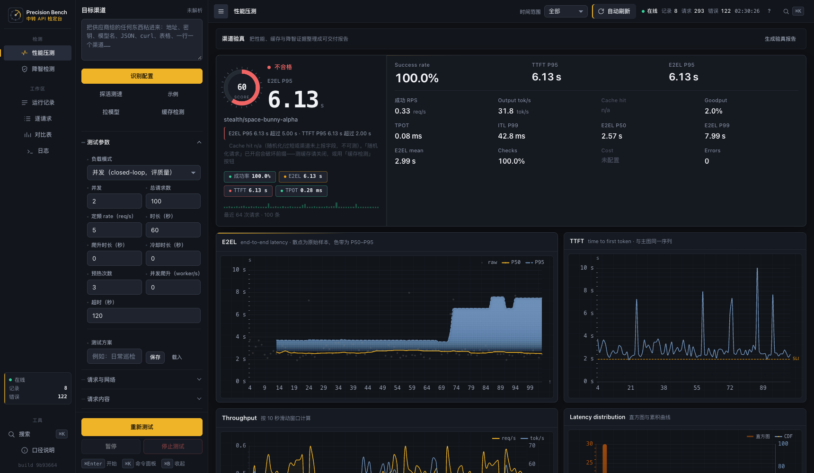
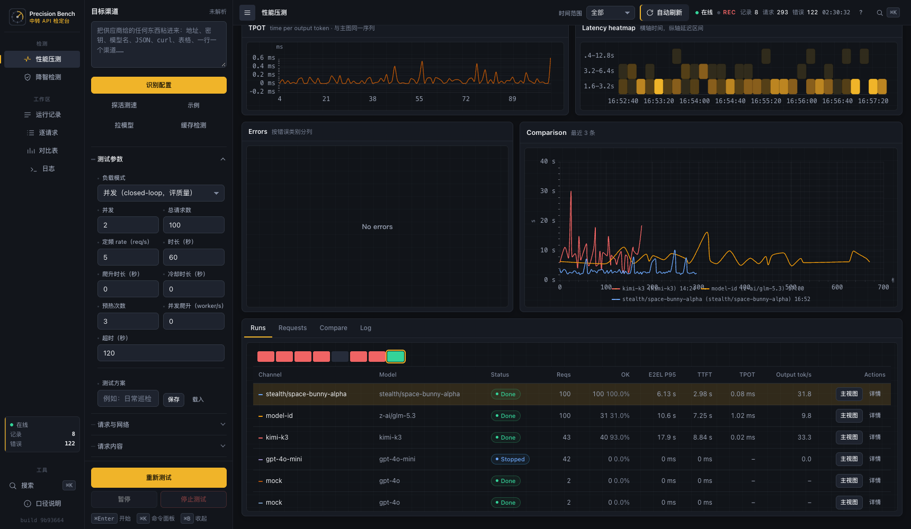
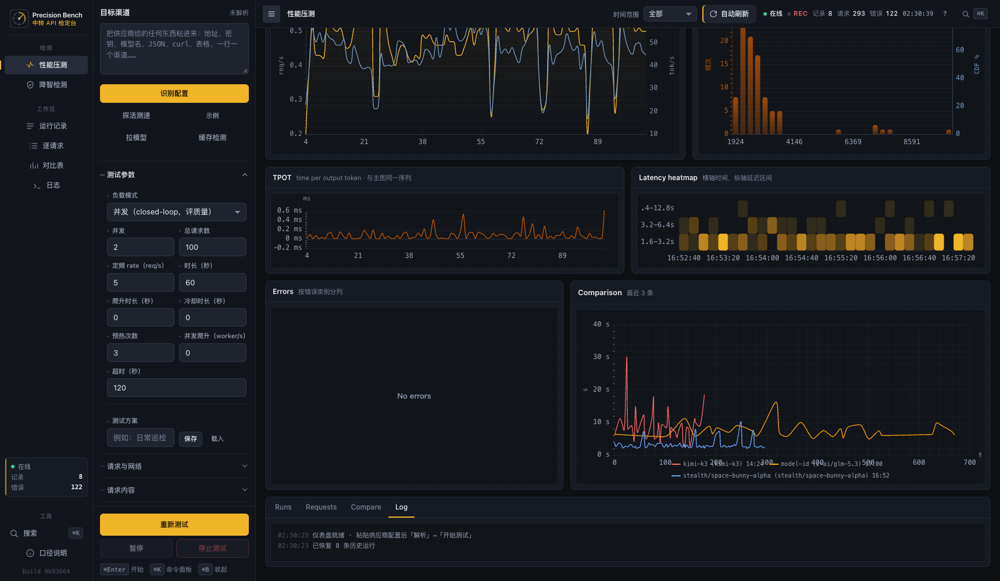

# Screenshots

All screenshots are captured from a local run against real channels (OpenRouter `stealth/space-bunny-alpha`, `z-ai/glm-5.3`, `kimi-k3`) and the bundled mock upstream, at 1720×1000. No mock-ups.

## Performance test

Verdict, SLO badges, latency percentiles, throughput, and the error timeline. The verdict block compares measured percentiles against the thresholds configured in the left panel.

## Degradation detection

Eight scored dimensions, baseline comparison, and per-item results. The first run for a `base_url + model` pair becomes the baseline; later runs report the delta and an output fingerprint check.

## Prompt-cache check

Cache probe settings: rounds, prefix length, provider threshold preset, speed-up threshold, and cache-friendly mode. The active probe result and history are shown after a run.

## Request samples

Raw per-request rows with TTFT / E2E / TPOT / in-out tokens / cache tokens, error-class filter, and CSV export of the current selection.

## Channel comparison

Side-by-side comparison of the most recent runs: success rate, goodput, RPS, E2E mean/P95, TTFT, TPOT, output tok/s, cache hit, and error count.

## Runs

Run list with per-channel status, request counts, percentiles, and a detail drawer with exports.

## Log

Run events, probe results, and failure samples as they happen.

